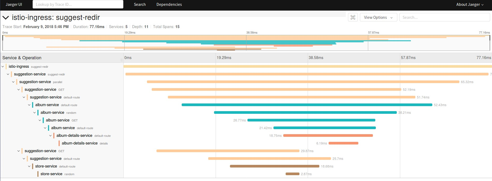

## Purpose 

Showcase Istio's Distributed Tracing capabilities with a set of properly instrumented Spring Boot applications

## Prerequisites

- Openshift 3.9 cluster
- Istio 0.7.1 (without auth enabled) installed on the aforementioned cluster.
To install Istio simply follow one of the following docs:
    * https://istio.io/docs/setup/kubernetes/quick-start.html
    * https://istio.io/docs/setup/kubernetes/ansible-install.html
- Enable automatic sidecar injection for Istio
  * See [this](https://istio.io/docs/setup/kubernetes/sidecar-injection.html) for details
- Login to the cluster with the admin user
- Jaeger installed in the istio-system namespace

## Environment preparation

```bash
    oc new-project demo-istio
    oc label namespace demo-istio istio-injection=enabled
```

**CAUTION**

Furthermore, it's required to manually change the `policy` field to `disabled` in configmap `istio-inject` in the `istio-system` namespace
and restart the `istio-sidecar-injector` pod

## Deploy project

### Build using FMP

```bash
    mvn clean fabric8:deploy -Popenshift
```

### Build using s2i
```bash
    find . | grep openshiftio | grep application | xargs -n 1 oc apply -f

    oc new-app --template=spring-boot-istio-distributed-tracing-booster-suggestion-service -p SOURCE_REPOSITORY_URL=https://github.com/snowdrop/spring-boot-istio-distributed-tracing-booster -p SOURCE_REPOSITORY_REF=master -p SOURCE_REPOSITORY_DIR=suggestion-service
    oc new-app --template=spring-boot-istio-distributed-tracing-booster-album-service -p SOURCE_REPOSITORY_URL=https://github.com/snowdrop/spring-boot-istio-distributed-tracing-booster -p SOURCE_REPOSITORY_REF=master -p SOURCE_REPOSITORY_DIR=album-service
    oc new-app --template=spring-boot-istio-distributed-tracing-booster-album-details-service -p SOURCE_REPOSITORY_URL=https://github.com/snowdrop/spring-boot-istio-distributed-tracing-booster -p SOURCE_REPOSITORY_REF=master -p SOURCE_REPOSITORY_DIR=album-details-service
    oc new-app --template=spring-boot-istio-distributed-tracing-booster-store-service -p SOURCE_REPOSITORY_URL=https://github.com/snowdrop/spring-boot-istio-distributed-tracing-booster -p SOURCE_REPOSITORY_REF=master -p SOURCE_REPOSITORY_DIR=store-service
```

### Expose services

```bash
    oc expose svc istio-ingress -n istio-system
    oc create -f rules/route-rule-redir.yml
```

### Open the application

Open the URL given by the following command:

```bash
echo http://$(oc get route istio-ingress -o jsonpath='{.spec.host}{"\n"}' -n istio-system)/suggest/
```


The traces from the invocation of the two endpoints should look like the following:

* Serial


* Parallel



## Formal description


### Serial invocation of dependent micro-services

*Actors*:
- User
- Suggestion Service
- Album Service
- Album Details Service
- Store Service

*Triggers*:
External system invokes the /serial endpoint of the Suggestion Service

*Preconditions*:
- All four services have been deployed to the Service Mesh
- All four services correctly propagate tracing HTTP headers
- The /serial endpoint of Suggestion Service is visible outside the cluster via an Istio RouteRule
- The implementation of the /serial endpoint calls the Album Service and the Store Service in a serial fashion

*Post-conditions*:
- Once the call to Suggestion Service has completed, then given that the users waits a few seconds, a Trace should show up in the Jaeger UI that will contain Spans from all four services (as well as the Istio proxies)
- The trace gathered by Istio clearly indicate the Album Service and Store Service were called in serial fashion from the Suggestion Service, thus giving valuable insights into the (non-optimal) implementation of the whole system, as well as providing accurate timing information

*Normal flow*:

- The user opens the Istio Distributed Web page
- The user clicks a button that results in an HTTP call to the /serial endpoint 
- The HTTP call is ultimately handled by the /serial endpoint of the Suggestion Service
- The implementation of the /serial endpoint calls the Album Service
- The Album Service calls the Album Details Service
- The Album Details service responds with some album details
- The Album Service uses its own data as well the data collected from the Album Details Service to respond to the Suggestion Service
- After collecting the response from the Album Service, the implementation of the /serial endpoint calls the Store Service
- The Store Service responds with the store details
- After collecting the response from the Store Service, the implementation of the /serial endpoint uses both the store and the album data to reply to the issuer of the call
- Once the call is done, the user navigates to the Jaeger Query UI and views the trace.

### Parallel invocation of dependent micro-services

*Actors*:
- User
- Suggestion Service
- Album Service
- Album Details Service
- Store Service

Triggers:
External system invokes the /parallel endpoint of the Suggestion Service

Preconditions:
- All four services have been deployed to the Service Mesh
- All four services correctly propagare tracing HTTP headers
- The /parallel endpoint of Suggestion Service is visible outside the cluster via an Istio RouteRule
- The implementation of the /parallel endpoint calls the Album Service and the Store Service in a parallel fashion

Post-conditions:
- Once the call to Suggestion Service has completed, then given that the users waits a few seconds, a Trace should show up in the Jaeger UI that will contain Spans from all four services (as well as the Istio proxies)
- The traces gathered by Istio clearly indicate the Album Service and Store Service were called in parallel fashion from Suggestion Service, thus giving valuable insights into the implementation of the whole system, as well as providing accurate timing information

Normal flow:

- The user opens the Istio Distributed Web page
- The user clicks a button that results in an HTTP call to the /parallel endpoint
- The HTTP call is ultimately handled by the /parallel endpoint of the Suggestion Service
- The implementation of the /parallel endpoint calls the Album Service
- The Album Service calls the Album Details Service
- The Album Details service responds with some album details
- The Album Service uses its own data as well the data collected from the Album Details Service to respond to the Suggestion Service
- Concurrently with the call to the Album Service, the implementation of the /parallel endpoint calls the Store Service
- The Store Service responds with the store details
- Once both calls to the Album and Store services are fulfilled, the implementation of the /parallel endpoint uses the responses to reply to the issuer of the call
- Once the call is done, the user navigates to the Jaeger Query UI and views the trace.
